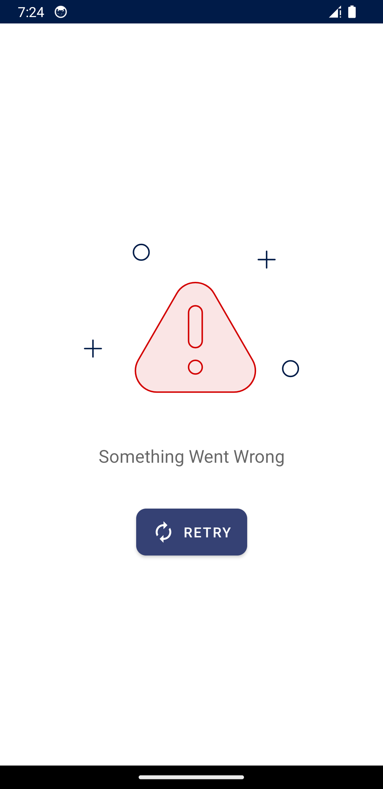

## Tech Stack
- Gradle 8.8 and AGP 8.3:
- [Version Catalog](https://docs.gradle.org/current/userguide/platforms.html#sub:version-catalog).
- 100% Kotlin:
    - DSL.
    - Coroutines.
- Architecture: Clean Arch + MVVM + Modularity.
- Offline first approach.
- Dagger Hilt for dependency injection.
- Jetpack arch Components.
- Navigation Component.
- Retrofit for networking.
- Logging interceptor to log API requests.
- Room DB.
- Unit Testing:
    - [Junit5](https://junit.org/junit5/docs/current/user-guide).
    - [Mockk](https://github.com/mockk/mockk).
    - [Kluent](https://github.com/MarkusAmshove/Kluent).
- Static analysis tools:
    - [Detekt](https://github.com/detekt/detekt).

## Screenshots

